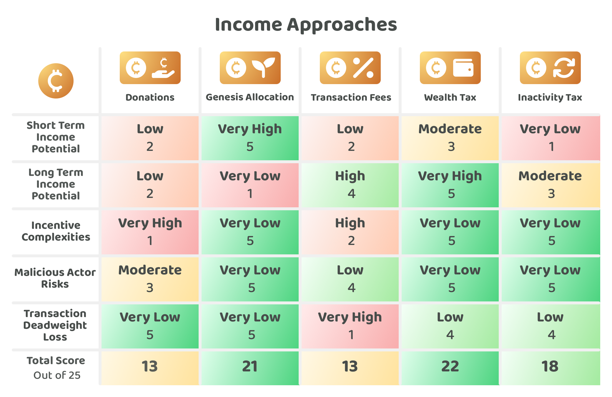

# Income approaches

Web3 ecosystem treasuries could help with maintaining and improving a network in both the short and long term. A number of approaches could help with generating income for an ecosystems treasury. In the short term an ecosystem may need to think about how it will bootstrap any initial assets for the treasury to support any new infrastructure, protocol or application developments. An ecosystem could also benefit from considering how ongoing income is generated so that the ecosystem becomes more self sustainable over the long term.

## Approaches for generating treasury income

Communities that want their ecosystem to be reliably maintained over the long term will need to think about how those contribution efforts will be paid for.

Some income approaches that could be used for generating treasury income include:

* **Donations** - Community members from the ecosystems make donations to help with paying for any contribution efforts.
* **Genesis allocation** - Community treasury assets are allocated prior to the launch of the network.
* **Transaction fees** - Some percentage of the networks transaction fees could be used as an income for the ecosystems treasury.
* **Reusing inactive assets** - Assets that have been inactive for a long period of time could be reused by the network and be a source of income for the ecosystems treasury.

To compare these income approaches a number of [factors have been considered](https://www.notion.so/Income-factors-for-consideration-2c0db56f61284eb9bd2a61fbbdcce289?pvs=21) and then applied to each approach to try and determine any strengths and weaknesses of each one.

<figure><figcaption></figcaption></figure>

**Key takeaways**

* **Plutocracy risks are not an income problem** - Plutocratic voting systems could give larger coin holders more influence over how this income is used. This is not an inherent problem with the income approaches mentioned above. The plutocracy voting influence problem is a funding problem rather than an income problem.
* **Very high risk if only adopting a donation approach** - The big risk for any Web3 ecosystem that has limited income is it will be more difficult to sustain the funds necessary to pay for any large amount of development effort for maintaining and improving the network. The incentive complexities and game theory risks are also greatly increased by relying on donations from the community due to the increased likelihood that these donations are heavily influenced by wealthier stakeholders each of which could have their own motives. Without any reliable treasury income there is an increased complexity for community members to get initiatives executed as now they have to be concerned with how many people are donating and how much they should donate to help with executing important initiatives. Ecosystem might even need to rely on contributors to give up their time for low salaries or for free at their own expense!
* **Genesis allocation could be important for bootstrapping network adoption** - A new Web3 ecosystem can often have a chicken and egg problem where it doesn’t have enough use cases and applications to generate transaction volume which means a limited amount of transaction fees and potential treasury fee income to pay for new applications and use cases. A genesis allocation could be an effective way to fund initial initiatives that could help with creating more demand for the network in the short term.
* **Transaction fees likely an important part of long term sustainability** - Genesis allocations can provide an effective approach to bootstrap a network and give the ecosystem enough time to generate more demand and transaction volume. If an ecosystem can achieve this the network could become increasingly self sustainable through a circular economy. Without this circular economy there is a risk that the ecosystem stagnates due to a lack of incentives to improve and maintain the network. Web3 ecosystems are still constantly making development updates and improvements to their networks. There is currently limited evidence to guarantee that any ecosystem will be finished and not need any further development and maintenance efforts. Most ecosystems could require ongoing amounts of contribution effort to maintain and improve the network over time. Network fees can provide a sustainable long term approach for continuously improving and developing the network.
* **Reusing inactive assets offers an effective supplementary approach** - It will take a while before reusing inactive assets would make any meaningful amount of income for an ecosystems treasury due to the delay in time before any assets could even be reused for being fully inactive. As well as this there will also likely be a limit on how much income this actually generates the treasury as many users could prevent the loss of any assets by utilising solutions that better protect there ability to access and move the assets in different scenarios. The obvious example being if someone passes away and they want to make sure their family and relatives are able to access their assets. Overall this approach is still beneficial for the ecosystem as it helps to prevent an increasing amount of deadweight assets over time that are unusable in dormant and lost wallets.
* **Ecosystems could benefit from adopting all of these income approaches** - A genesis allocation, transaction fees and reusing inactive assets can all be adopted as income approaches that can support a single ecosystem. Although donations might not be as reliable for consistent income as transaction fees this approach still be very beneficial for certain use cases and funding initiatives. Together these approaches can help to better ensure there is sufficient funds available for an ecosystem to be properly maintained and improved over the short and long term.

**Income approaches analysis**


[income-factors-for-consideration.md](income-factors-for-consideration.md)



[donations.md](donations.md)



[genesis-allocation.md](genesis-allocation.md)



[transaction-fees.md](transaction-fees.md)



[reusing-inactive-assets.md](reusing-inactive-assets.md)

