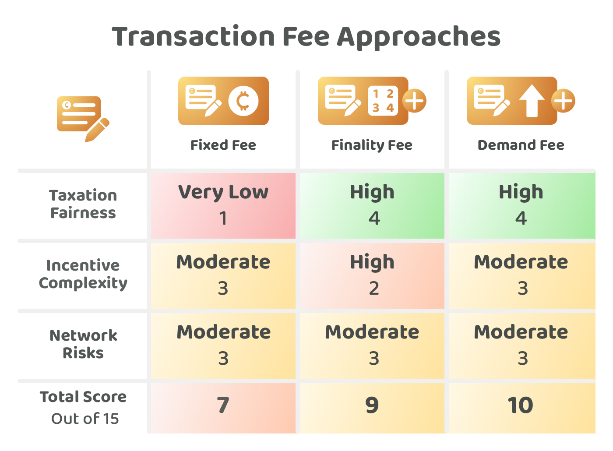

# Transaction fee approaches

Each transaction that a user wants to submit and store on a distributed ledger will result in a certain amount of processing and storage costs. Transaction fees are used to pay for validator nodes that will verify and maintain the ledgers. Transaction fees could also be used as treasury income to pay for maintaining and improving the network.

A network's adopted fee approach can have a profound impact on how fair and stable that ecosystem will be over the long term. Web3 ecosystems will often have community members that have a varying amount of wealth and also have users that use the network for different purposes and with different usage patterns. Transaction fees will influence these behaviours and usage patterns and will also become a highly important factor for the long term adoption and sustainability of these networks. The transaction fee approach that a network adopts could be a defining factor why people use one network over another.

## **Approaches for transaction fees**

The following are some example transaction fee approaches that could be used for operating the network and generating treasury income:

* [**Fixed fee**](fixed-fee.md) - A fixed fee amount is charged to create a transaction, the fee amount stays the same regardless of how big or small the transaction is.
* [**Percentage fee**](percentage-fee.md) - The fee is a percentage amount calculated using the total transaction value. The larger the value of a transaction the larger the fee.
* [**Fixed & percentage fee**](fixed-and-percentage-fee.md) - The fee is a combination of the fixed fee and percentage fee approaches.
* [**Percentage finality fee**](percentage-finality-fee.md) - Transactions could be prioritised when users are willing to pay a higher percentage fee than the other submitted transactions.
* [**Percentage demand fee**](percentage-demand-fee.md) - The fees to make transactions on the network are increased when the network has a high or excessive amount of transaction volume demand.

To compare these decision approaches a number of [factors have been considered](transaction-fee-factors-for-consideration.md) and then applied to each approach to try and determine the strengths and weaknesses of each one.

<figure><figcaption></figcaption></figure>

**Key takeaways**

* **Unfairness of fixed fees -** The wealth that exists in any ecosystem will likely not be split equally between its users. It will often be the case that there are some individuals that are far wealthier than others and there will also be individuals who are far poorer than everyone else. Similar to existing fiat systems this factor translates into different user behaviours and spending habits due to the wealth that each user has available to them. Fixed fees would simply mean that the wealthier individuals that can make larger transactions would be paying less tax proportionally with their transaction fees than the poorest individuals in the ecosystem. The wealthiest individuals would pay the least in fees proportionally and the poorest would pay the most. This is inherently unfair as the poorest individuals would now be paying the most in fees proportionally to their usage of the network. The richest individuals would be receiving the same security and safety benefits from the network but would receive those benefits, security and protection for a much larger amount of assets. The poorer individuals would be paying proportionally more in fees to the network to secure the assets of wealthier people who have paid less than others proportionally. A fixed fee approach could become a contributing factor towards an increasing wealth gap between the wealthy and poor over the long term. Some other additive fee approaches to mention are fixed fee approaches to mention are fixed finality fees and fixed demand fees. These have been excluded from the comparison due to this same fixed fee issue of them being unfair for poorer users in the network.
* **Necessity of fixed fees -** Although fixed fees are inherently unfair to the poorest individuals in a network the requirement to use a fixed fee approach is not easily avoided. If transaction fees are percentage based and proportional to the value of the transaction the easy attack vector that emerges is that people can flood the network with extremely small transactions that have a tiny fee. The network will only be able to handle a certain amount of transaction volume and also will require a certain level of income to pay for the processing and storage costs. Fixed fees are likely a necessary part of the solution for preventing the network from being spammed. This necessity for fixed fees helps to highlight the paramount importance of making highly scalable networks that can have a low minimum fixed fee. Highly scalable networks can use a much smaller fee to pay for the operational costs of verifying and storing a large number of transactions. The lower the minimum fixed fee is the more egalitarian the network becomes due to the reduced impact that fixed fee will have on poorer individuals.
* **Percentage fees are fairer and more egalitarian** - Percentage fees treat transactions equally by using a proportional fee against the value of a transaction. This approach is fairer for individuals in a network as it respects the fact that every individual in the network will likely have a varying amount of wealth. These individuals will all be transacting with different amounts of asset value and at different frequencies. Although percentage fees are more egalitarian and fair for every user a minimum fixed fee will still likely be necessary to prevent spam and increase network stability.
* **Fixed and percentage fees are an effective combined fee approach** - Combining fixed fees with percentage fees helps to ensure the network is protected from spam and also helps to prevent wealthy individuals from having a tax advantage. The important of scalability cannot be understated as this fee would have the largest impact on the poorest individuals. Networks that are highly scalable will be cheaper and fairer to use for poorer individuals.&#x20;
* **Finality fees could be useful but they also introduce front running complexity** - Allowing people to pay more to get their transactions prioritised and finalised is useful for situations where an individual needs their transaction to finalise much more quickly. Other users might not mind exactly when their transaction is finalised for certain use cases. The main issues with adding this finality fee approach is that every protocol and application will need to be aware of the fact that the order of any pending transactions can change at any moment due to users that are able to outbid other pending transactions. This could add complexity to the network as it might introduce incentives to front run certain transactions to generate a financial benefit from finalising faster than the currently pending transactions. An alternative solution to this problem of high fast finality requirement is to improve the speed and scalability of the network itself so it can handle the expected demand and the growing demand over time. Horizontally scalable networks that can increase the transaction throughput of the network by simply increasing the number of nodes could be one example where finality fees might not be necessary as a solution. Instead these networks would be able to quickly finalise all the transactions that are submitted as the network can scale to handle a growing amount of volume.
* **Demand fees can be effective for balancing the load of transactions over time** - Demand fees are a potentially effective solution for responding to any sudden spikes in transaction volume that the network can’t handle at that given moment in time. Users that wanted to have a cheaper transaction or that didn’t have a high priority transaction would be more incentivised to delay their transaction until the demand fees are reduced. These reactionary incentives could be effective for balancing the load of the network so that a more steady and constant stream of transactions can be handled by the network. Similar to finality fees this approach could potentially be unnecessary in situations where the network keeps a certain buffer of capacity available to handle this spike of transactions and that can increase its throughput by adding more nodes to handle the demand increase.
* **Transaction fee approaches can be combined together** - A fixed and percentage fee approach is a highly promising long term solution for Web3 ecosystems to consider. Finality and demand based fee approaches could be effective additional approaches to build on top of a fixed and percentage fee approach to better handle different finality use cases and quickly changing levels of demand.

**Transaction fee approaches analysis**


[transaction-fee-factors-for-consideration.md](transaction-fee-factors-for-consideration.md)



[fixed-fee.md](fixed-fee.md)



[percentage-fee.md](percentage-fee.md)



[fixed-and-percentage-fee.md](fixed-and-percentage-fee.md)



[percentage-finality-fee.md](percentage-finality-fee.md)



[percentage-demand-fee.md](percentage-demand-fee.md)

